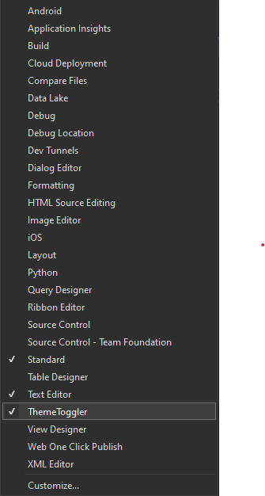

# ThemeToggler

An easy way to toggle between light and dark theme in your trusted visual studio environment

Download this extension from the [Marketplace](komt nog!)
or get the [CI build](komt nog).

-----------------------------------------

This extension adds a toolbar to the **MainToolBar**. You can add this toolbar to your **MainToolBar** by right clicking on the **MainToolBar** and selecting **ThemeToggler**. From this point you can drag the **ThemeToggler** to the desired location in your **MainToolBar**. Enjoy toggling themes!

## License
[MIT](LICENSE.txt)
